<div align="center">

# XerifeTV Web

**Plataforma de streaming de filmes e séries — o front-end do ecossistema XerifeTV.**

Catálogo com destaque, player HLS com várias fontes e qualidades, progresso sincronizado,
perfil personalizável com capa, badges, favoritos e avaliações.


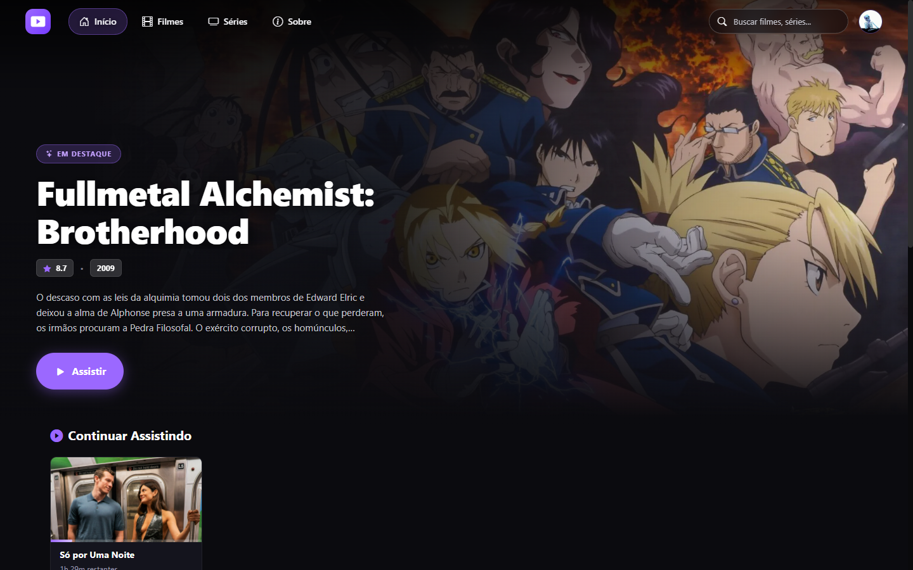

</div>

---

## Sumário

- [Telas](#telas)
- [Funcionalidades](#funcionalidades)
- [Stack](#stack)
- [Como rodar](#como-rodar)
- [Configuração](#configuração)
- [Estrutura do projeto](#estrutura-do-projeto)
- [Scripts](#scripts)
- [Back-end](#back-end)

## Telas

### Catálogo

| Filmes | Séries |
| :---: | :---: |
| 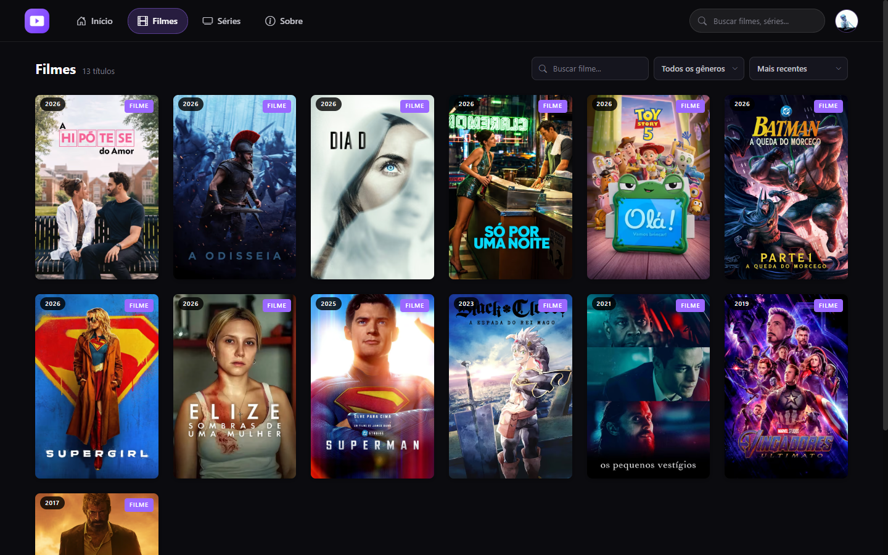 | 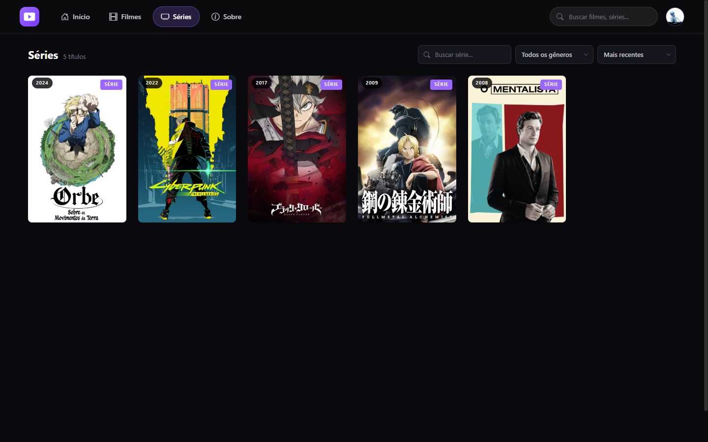 |

### Página do título

| Filme | Série |
| :---: | :---: |
| 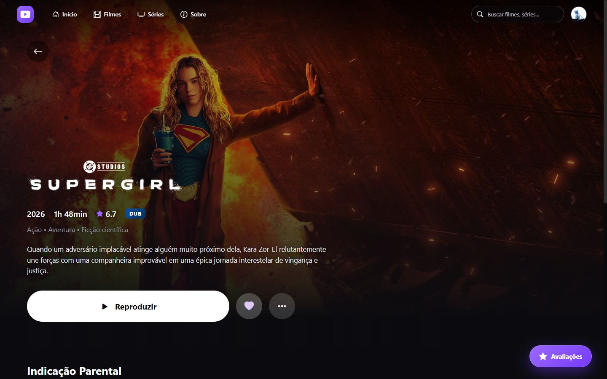 | 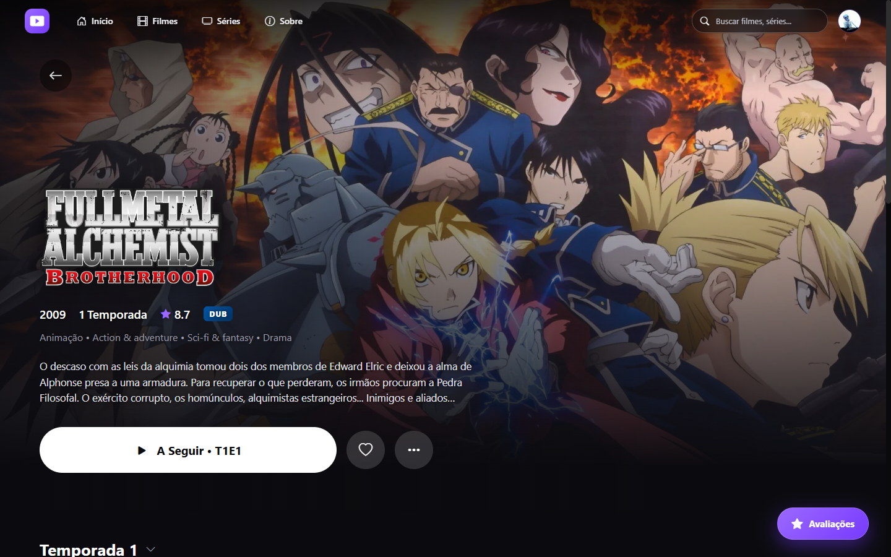 |

| Episódios | Detalhes e avaliações |
| :---: | :---: |
| 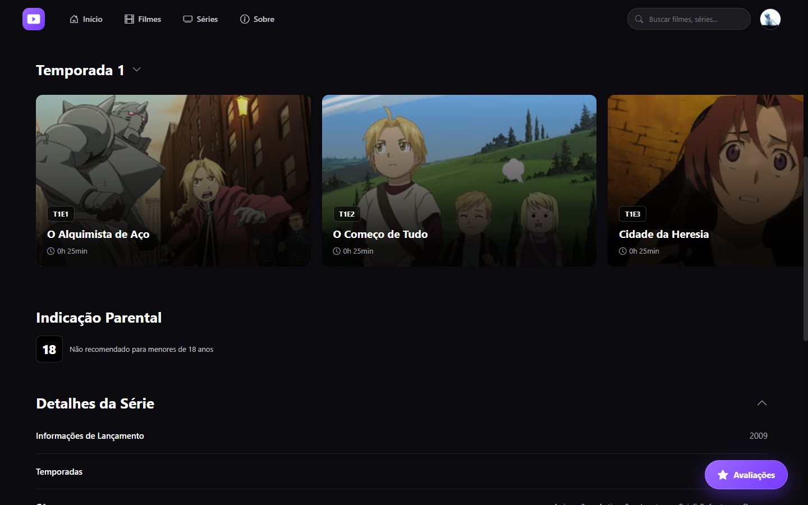 | 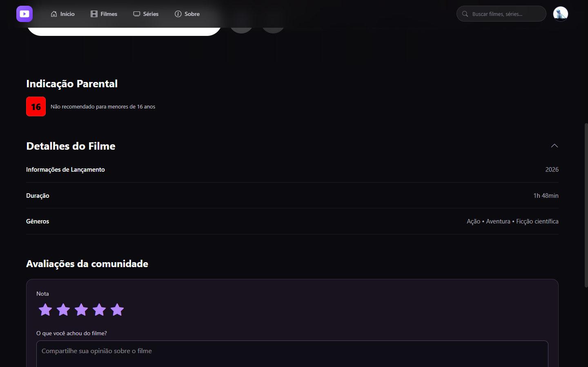 |

### Perfil

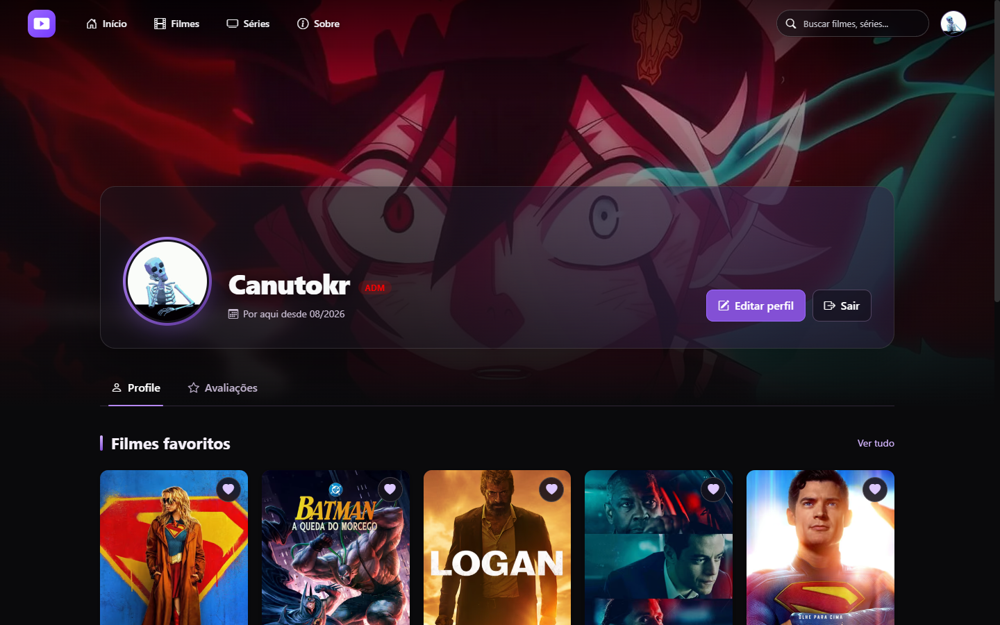

### Mobile

| Início | Título | Perfil |
| :---: | :---: | :---: |
| 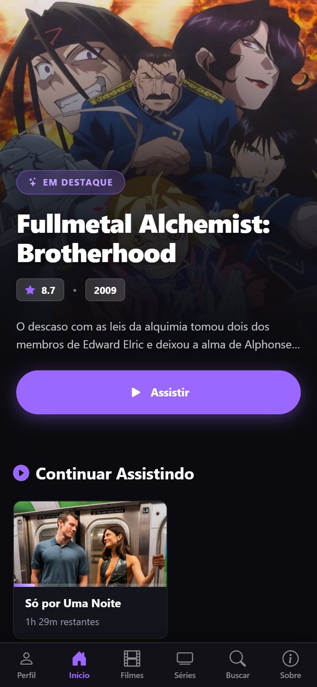 | 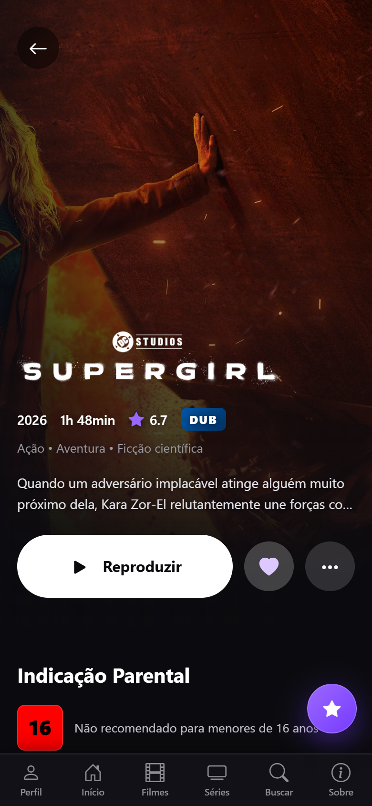 | 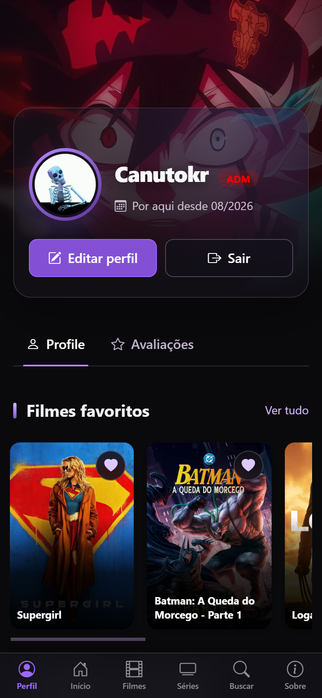 |

### Login

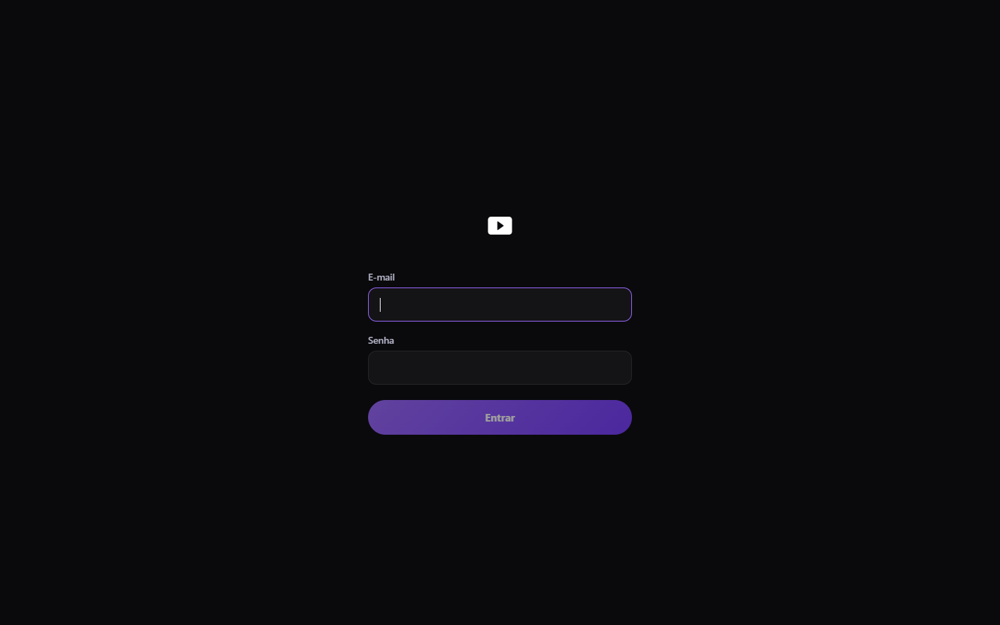

## Funcionalidades

**Catálogo e descoberta**
- Home com título em destaque, **Continuar Assistindo** e carrosséis.
- Catálogos de filmes e séries com busca, filtro por gênero e ordenação.
- Busca global na topbar com resultados em tempo real.
- Canais agrupados por categoria.
- Recomendações na página de cada título.

**Página do título**
- Banner imersivo com a topbar transparente, que fica sólida ao rolar.
- Detalhes (lançamento, idioma original, país de origem) e classificação indicativa.
- Temporadas e episódios, com marcação dos já assistidos e botão "A Seguir".
- Versões **dublada e legendada**, quando disponíveis.
- Favoritar, avaliar e botão flutuante que leva direto às avaliações.

**Player**
- Reprodução **HLS** (via `hls.js`) e MP4.
- Várias fontes por título, com troca manual de qualidade e fallback automático quando uma fonte falha.
- Abre na hora e carrega o vídeo por dentro, sem travar o botão de reproduzir.
- Retoma de onde parou (**progresso salvo na API**) e avança para o próximo episódio.
- Controles próprios: velocidade, avançar/voltar 10s, volume e tela cheia.

**Perfil**
- Avatar por link ou **GIF do GIPHY**, imagem de capa e badge em destaque.
- Filmes e séries favoritos, assistidos recentemente e avaliações (editar/excluir).
- Seções vazias ficam ocultas; carregamento com skeleton, sem "piscar".

**Conta e acesso**
- Login com token JWT e renovação automática (`auth.interceptor`).
- Rotas protegidas por autenticação e por permissão (`auth.guard`, `permission.guard`).

**Experiência**
- Layout responsivo com barra de navegação inferior no mobile.
- Acessibilidade: HTML semântico, `aria-*`, foco visível e respeito a `prefers-reduced-motion`.

## Stack

| Camada | Tecnologia |
| --- | --- |
| Framework | [Angular 22](https://angular.dev) — standalone components, **signals**, control flow (`@if`/`@for`/`@defer`) |
| Linguagem | TypeScript 6 |
| Estilo | CSS por componente + [Tailwind CSS 4](https://tailwindcss.com) + [Bootstrap 5.3](https://getbootstrap.com) |
| Ícones | [Bootstrap Icons](https://icons.getbootstrap.com) |
| Vídeo | [hls.js](https://github.com/video-dev/hls.js) |
| HTTP / estado | `HttpClient` + RxJS 7 + signals |
| Testes | [Vitest](https://vitest.dev) + jsdom |
| Formatação | Prettier |

## Como rodar

**Pré-requisitos:** Node.js 22.22+ ou 24.15+ (exigência do Angular 22) e npm 11.

```bash
npm install
```

```bash
npm start
```

A aplicação sobe em **http://localhost:4300**.

## Configuração

A URL da API fica em `src/app/environments/environment.ts`:

```ts
const isProduction = true;

export const environment = {
  production: isProduction,
  apiUrl: isProduction
    ? '' // API publicada
    : 'http://localhost:5003/',         // XerifeTv.CMS rodando local
};
```

Para apontar para o back-end local, troque `isProduction` para `false`.

O picker de GIFs do perfil usa a API do GIPHY, configurada em `src/app/environments/giphy.config.ts`.

## Estrutura do projeto

```text
src/app
├── pages/                  # Uma pasta por rota
│   ├── home/               # Destaque, continuar assistindo, carrosséis
│   ├── movies/ · series/   # Catálogos com filtros
│   ├── channels/           # Canais por categoria
│   ├── watch/              # Página do título (filme/série) + player
│   ├── profile/            # Perfil, favoritos, avaliações, badges
│   ├── search/ · about/ · login/ · access-denied/
├── shared/
│   ├── components/         # navbar, video-player, media-card, review-dialog, ...
│   ├── data/               # Cliente da API de conteúdo, tipos e mappers
│   ├── services/           # auth, profile, watch-progress, feedback, giphy
│   ├── guards/             # auth.guard, permission.guard
│   ├── interceptors/       # auth.interceptor (Bearer + refresh)
│   └── models/
└── environments/
```

## Scripts

| Comando | O que faz |
| --- | --- |
| `npm start` | Servidor de desenvolvimento em `localhost:4300` |
| `npm run build` | Build de produção em `dist/` |
| `npm run watch` | Build de desenvolvimento em modo watch |
| `npm test` | Testes unitários com Vitest |

## Back-end

O XerifeTV Web consome a API do **XerifeTv.CMS** (ASP.NET Core + MongoDB), que também é o painel
administrativo do catálogo. A especificação da API está em [`api/v1.json`](api/v1.json).
